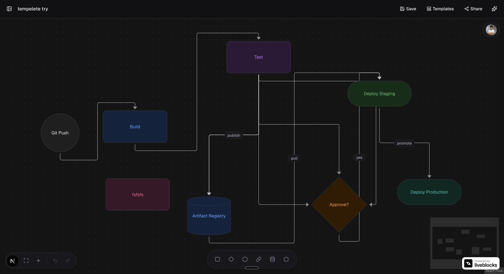
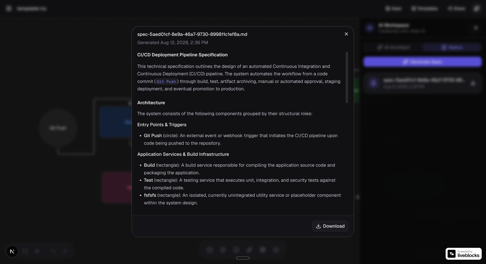
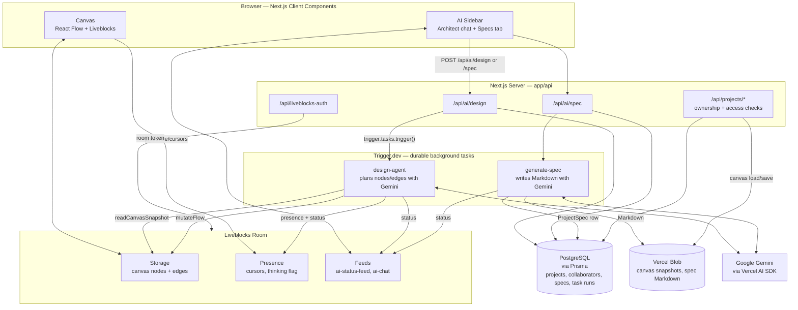
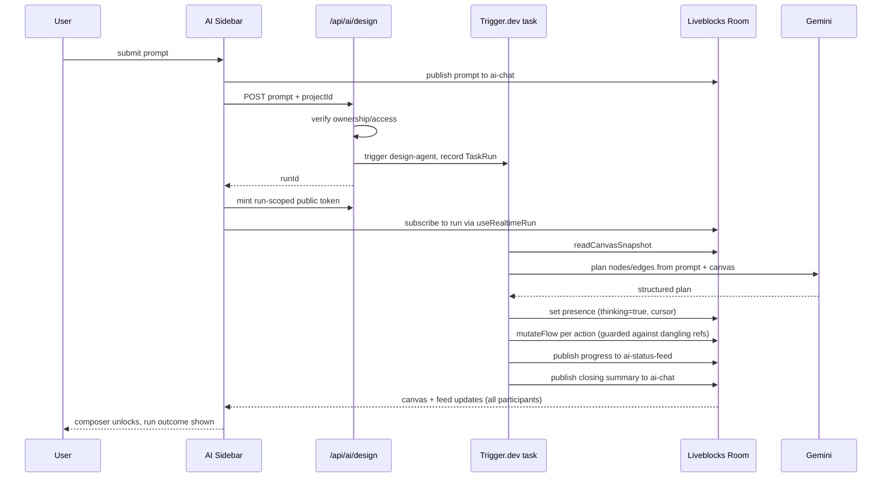

# Jhakri AI

**A real-time collaborative system design workspace — describe a system in plain English, watch an AI agent draw it on a shared canvas, refine it with collaborators, and turn the result into a technical spec.**

*Live demo: coming soon*



## Contents

- [The Problem](#the-problem)
- [What Jhakri AI Does](#what-jhakri-ai-does)
- [Core Features](#core-features)
- [Architecture](#architecture)
- [Tech Stack](#tech-stack)
- [Repository Structure](#repository-structure)
- [Key Design Decisions](#key-design-decisions)
- [Running Locally](#running-locally)
- [Roadmap](#roadmap)

---

## The Problem

Sketching a system design usually means a whiteboard, a scattered set of boxes and arrows nobody else can read later, and a separate slog to turn that sketch into a document anyone can actually reference. Diagramming tools handle the drawing; they don't understand the system. Writing the accompanying spec is a second, disconnected task that drifts out of sync with the diagram the moment either one changes.

Jhakri AI treats the diagram and the spec as two views of the same underlying graph — described once, drawn by AI, refined collaboratively, and exported as a document that always reflects the canvas it came from.

## What Jhakri AI Does

1. **Sign in and create a project** — each project is a Liveblocks room with its own owner and collaborators.
2. **Start from a prompt or a template** — describe a system in plain English, or drop in a prebuilt starter design (monolith, microservices, event-driven, serverless, ...).
3. **AI generates the architecture** — an agent reads the current canvas, plans nodes and edges with Gemini, and writes them into the shared room live, as a visible participant with its own cursor.
4. **Collaborators refine it together** — real-time cursors, presence, and canvas edits, the same as any multiplayer tool.
5. **Generate the spec** — the current graph is converted into a Markdown technical specification, saved, and downloadable.

## Core Features

**Authentication & Projects**
- Clerk-backed sign-in and route protection.
- Project creation, single ownership, and per-project collaborator access.

**Collaborative Canvas**
- Real-time shared canvas built on Liveblocks + React Flow — live cursors, presence avatars, and node/edge editing.
- Six node shapes (rectangle, diamond, circle, pill, cylinder, hexagon) across an 8-color palette, plus resize, inline label editing, and a per-node color toolbar.
- Undo/redo, keyboard shortcuts, zoom/fit controls, and debounced autosave to durable storage.

**Starter System Designs**
- A curated library of prebuilt canvas templates covering common architecture patterns, importable at any point during editing.

**AI Architecture Generation**
- Natural-language prompt → structured nodes and edges, applied directly to the shared canvas.
- Runs as a durable Trigger.dev background task; the agent shows up in the room with a live cursor and a "thinking" indicator while it works.
- Shared status feed and chat, so every collaborator sees the same run progress and outcome, not just whoever started it.

**Spec Generation**
- Converts the current canvas graph into a Markdown technical spec via Gemini.
- Specs are persisted, listed per project, previewable inline, and downloadable.



## Architecture

Jhakri AI splits state across three layers on purpose: Postgres owns relational metadata, Liveblocks owns the live collaborative graph, and Vercel Blob owns durable generated artifacts. Long-running AI work never runs inside a request handler — it's always a Trigger.dev background task.



### The AI Design Run



## Tech Stack

| Layer             | Technology                        | Role                                                          |
| ------------------ | ---------------------------------- | --------------------------------------------------------------- |
| Framework          | Next.js 16 + TypeScript (strict)   | Full-stack app with server/client component boundaries          |
| UI                 | Tailwind CSS 4 + shadcn/ui         | Dark-only design system, token-based colors, no raw hex values   |
| Auth               | Clerk                              | Sign-in, session, and route protection                          |
| Canvas             | Liveblocks + `@xyflow/react` (React Flow) | Real-time collaborative graph, presence, cursors, feeds  |
| Database           | PostgreSQL + Prisma 7              | Relational metadata: projects, collaborators, specs, task runs  |
| Background tasks   | Trigger.dev                        | Durable AI generation workflows, retried and tracked            |
| AI                 | Google Gemini via Vercel AI SDK (`ai`, `@ai-sdk/google`) | Architecture planning + spec generation |
| Artifact storage   | Vercel Blob                        | Canvas snapshots and generated Markdown specs (private access)  |
| Validation         | Zod                                | Request and task-payload validation at every boundary           |

## Repository Structure

```
jhakri-ai/
├── app/
│   ├── api/
│   │   ├── ai/
│   │   │   ├── design/               ← trigger + track a design run, mint run tokens
│   │   │   └── spec/                 ← trigger + track a spec run, mint run tokens
│   │   ├── liveblocks-auth/          ← room token issuance, membership-gated
│   │   └── projects/
│   │       ├── [projectId]/
│   │       │   ├── canvas/           ← canvas save/load (Vercel Blob)
│   │       │   ├── collaborators/    ← add/remove project collaborators
│   │       │   └── specs/            ← list + download generated specs
│   │       └── route.ts              ← project create/list
│   ├── editor/
│   │   ├── page.tsx                  ← project list / home
│   │   └── [roomId]/page.tsx         ← the collaborative workspace
│   ├── sign-in/, sign-up/            ← Clerk auth pages
│   └── layout.tsx, page.tsx
│
├── components/
│   ├── editor/
│   │   ├── canvas/                   ← canvas.tsx, nodes, edges, cursors, presence, controls
│   │   ├── ai-sidebar.tsx            ← Architect chat + Specs tabs
│   │   ├── design-run-watcher.tsx    ← per-run realtime subscription (key={runId})
│   │   ├── spec-run-watcher.tsx
│   │   ├── save-button.tsx
│   │   ├── starter-templates.ts      ← template definitions
│   │   └── spec-preview-modal.tsx
│   ├── auth/                         ← auth shell
│   └── ui/                           ← shadcn/ui primitives
│
├── trigger/
│   ├── design-agent.ts               ← reads canvas → plans with Gemini → mutateFlow
│   └── generate-spec.ts              ← canvas + chat context → Markdown → Blob + Prisma
│
├── lib/
│   ├── design-canvas.ts              ← mutateFlow action handlers (per-action guards)
│   ├── design-model.ts, spec-model.ts ← Gemini prompt construction, model config
│   ├── design-actions.ts             ← validated action schema for AI-planned edits
│   ├── project-access.ts             ← ownership/collaborator authorization
│   ├── liveblocks.ts                 ← server-side Liveblocks client
│   ├── prisma.ts                     ← Prisma client singleton
│   └── spec-request.ts               ← shared Zod schemas (route + task)
│
├── hooks/
│   ├── use-canvas-autosave.ts        ← debounced save + manual save trigger
│   ├── use-ai-status.ts              ← reads latest ai-status-feed message, optionally task-scoped
│   ├── use-ai-chat.ts                ← publish/subscribe to ai-chat
│   └── use-project-specs.ts
│
├── types/
│   ├── canvas.ts                     ← node/edge shapes, colors, sizes
│   └── tasks.ts                      ← ai-status-feed / ai-chat payload schemas
│
├── prisma/
│   ├── schema.prisma
│   └── models/                       ← project.prisma, task-run.prisma, project-spec.prisma
│
├── AGENTS.md                         ← required reading order for AI coding agents in this repo
├── CLAUDE.md                         ← general coding-agent behavioral guidelines
└── context/
    ├── project-overview.md           ← product definition, goals, scope
    ├── architecture-context.md       ← system boundaries, storage model, invariants
    ├── ui-context.md                 ← theme, colors, typography, canvas conventions
    ├── code-standards.md             ← implementation rules
    ├── ai-workflow-rules.md          ← scoping and delivery workflow
    └── progress-tracker.md           ← live record of what's built and why
```

## Key Design Decisions

**Storage is split by what it's for, not by convenience.** Relational facts (ownership, collaborators, task runs, spec metadata) live in Postgres via Prisma. The live collaborative graph lives in Liveblocks Storage. Large generated artifacts — canvas snapshots and spec Markdown — live in Vercel Blob, with only their URL referenced from Postgres. No large generated content is ever stored directly in the database.

**The AI agent is a room participant, not a black box.** While a design run is active, the agent publishes ephemeral Liveblocks presence (a live cursor plus a `thinking` flag) so it renders through the same cursor/avatar components as a human collaborator, with no special-casing. Progress and outcomes go through a shared feed (`ai-status-feed`) rather than per-client state, so every participant — not just whoever started the run — sees identical status, survives a reconnect, and can join mid-run.

**Everything the model chooses comes from a closed set.** The AI never emits raw pixel values, colors, or positions — only a shape name, palette name, grid cell, or size name from a fixed set, with the actual pixel/color values computed from those names in code. Documented shape, color, and spacing rules hold by construction, not by hoping the model follows the prompt.

**Long-running AI work never runs inside a request handler.** `/api/ai/design` and `/api/ai/spec` validate, authorize, and trigger a Trigger.dev task, then return immediately with a run ID. All Gemini calls and canvas writes happen inside the durable task, which can retry independently of the HTTP request that started it.

**The canvas is the source of truth; the client's copy of it is not trusted at save time.** Autosave used to trust whatever graph the client's local copy carried when the debounce timer fired — a stale tab could silently regress what a later reload sees. The save route now reads the live Liveblocks Storage snapshot itself rather than the client-supplied body, so every save persists the one converged state directly.

**Two Liveblocks feeds, kept deliberately separate.** `ai-status-feed` carries run progress (typed, per-task, `design` or `spec`); `ai-chat` carries the human-readable conversation. Keeping them apart means a status update and a chat message can never be mistaken for each other, and each tab in the AI sidebar can read only the feed messages that belong to it.

**`roomId` and `projectId` are the same identifier throughout the app** — a Liveblocks room is created implicitly per project, not provisioned separately, which is why route handlers can derive project access directly from a room ID with no extra lookup table.

## Running Locally

### Prerequisites

- Node 18+
- A PostgreSQL database
- Accounts/keys for: [Clerk](https://clerk.com), [Liveblocks](https://liveblocks.io), [Trigger.dev](https://trigger.dev), [Vercel Blob](https://vercel.com/storage/blob), and Google AI (Gemini)

### Setup

```bash
git clone https://github.com/Pranillama/jhakri-ai.git
cd jhakri-ai
npm install
```

Create a `.env.local` with:

```bash
DATABASE_URL=

NEXT_PUBLIC_CLERK_PUBLISHABLE_KEY=
CLERK_SECRET_KEY=
NEXT_PUBLIC_CLERK_SIGN_IN_URL=
NEXT_PUBLIC_CLERK_SIGN_UP_URL=

LIVEBLOCKS_PUBLIC_KEY=
LIVEBLOCKS_SECRET_KEY=

BLOB_READ_WRITE_TOKEN=

TRIGGER_SECRET_KEY=

GOOGLE_AI_API_KEY=
```

Apply the database schema:

```bash
npx prisma migrate dev
```

### Run

```bash
npm run dev              # → http://localhost:3000

# in a second terminal, for AI generation to actually run:
npx trigger.dev@latest dev
```

### Scripts

| Command | What it does |
|---|---|
| `npm run dev` | Starts the Next.js dev server |
| `npm run build` | Production build |
| `npm run start` | Serves the production build |
| `npm run lint` | Runs ESLint |

## Roadmap

Explicitly out of scope for now, per `context/project-overview.md`:

- Billing and subscription systems
- Enterprise permission tiers beyond owner and collaborator
- Versioned spec history and review workflows
- Production object storage migration
- Mobile-native applications

<!-- TODO: more screenshots welcome — starter template import, AI generation mid-run with agent cursor -->
